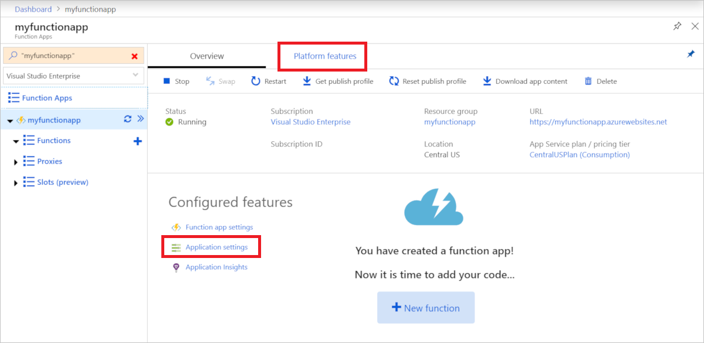
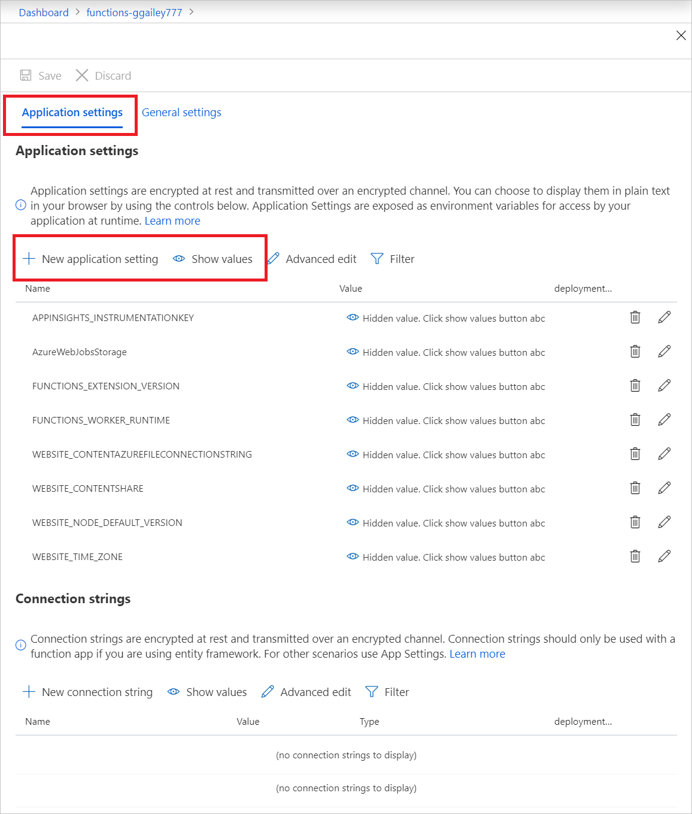
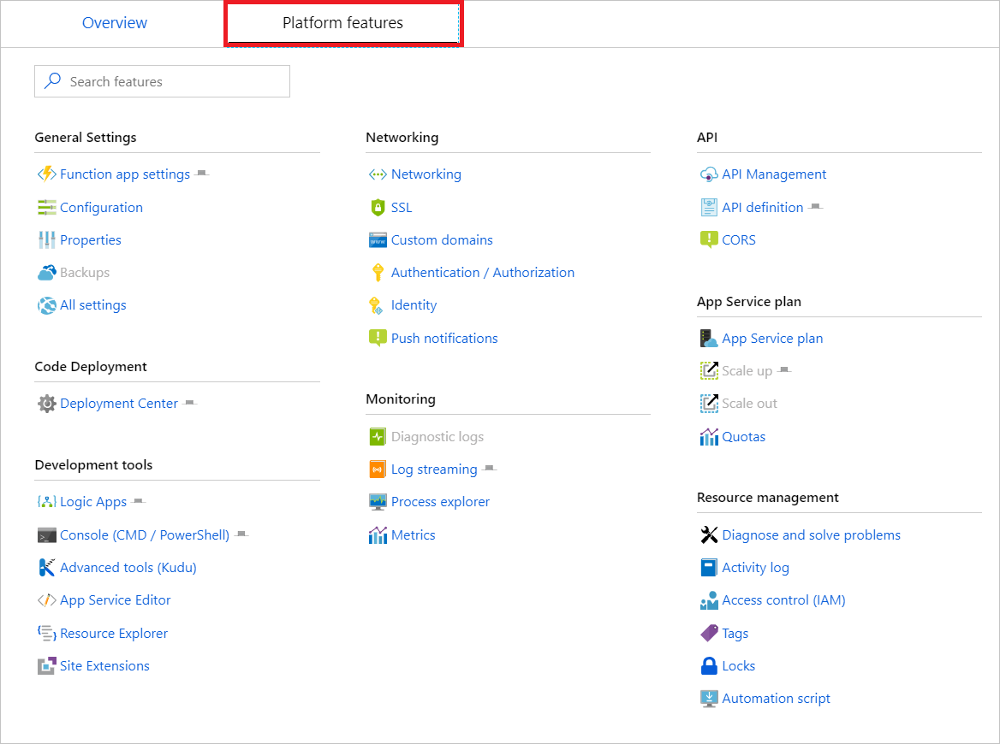

# How to manage a function app in the Azure portal 

In Azure Functions, a function app provides the execution context for your individual functions. Function app behaviors apply to all functions hosted by a given function app. This topic describes how to configure and manage your function apps in the Azure portal.

To begin, go to the [Azure portal](https://portal.azure.com) and sign in to your Azure account. In the search bar at the top of the portal, type the name of your function app and select it from the list. After selecting your function app, you see the following page:

You can navigate to everything you need to manage your function app from the overview page, in particular the **[Application settings](#settings)** and **[Platform features](#platform-features)**.

## Application settings

The **Application Settings** tab maintains settings that are used by your function app.

These settings are stored encrypted, and you must select **Show values** to see the values in the portal.

To add a setting, select **New application setting** and add the new key-value pair.

[!INCLUDE [functions-environment-variables](../../includes/functions-environment-variables.md)]

When you develop a function app locally, these values are maintained in the local.settings.json project file.

## Platform features

Function apps run in, and are maintained, by the Azure App Service platform. As such, your function apps have access to most of the features of Azure's core web hosting platform. The **Platform features** tab is where you access the many features of the App Service platform that you can use in your function apps. 

> [!NOTE]
> Not all App Service features are available when a function app runs on the Consumption hosting plan.

The rest of this topic focuses on the following App Service features in the Azure portal that are useful for Functions:

+ [App Service editor](#editor)
+ [Console](#console)
+ [Advanced tools (Kudu)](#kudu)
+ [Deployment options](#deployment)
+ [CORS](#cors)
+ [Authentication](#auth)
+ [API definition](#swagger)

For more information about how to work with App Service settings, see [Configure Azure App Service Settings](../app-service/web-sites-configure.md).

### App Service Editor

| | |
|-|-|
|   | The App Service editor is an advanced in-portal editor that you can use to modify JSON configuration files and code files alike. Choosing this option launches a separate browser tab with a basic editor. This enables you to integrate with the Git repository, run and debug code, and modify function app settings. This editor provides an enhanced development environment for your functions compared with the default function app blade.    |

### Console

| | |
|-|-|
|  | The in-portal console is an ideal developer tool when you prefer to interact with your function app from the command line. Common commands include directory and file creation and navigation, as well as executing batch files and scripts. |

### Advanced tools (Kudu)

| | |
|-|-|
|  | The advanced tools for App Service (also known as Kudu) provide access to advanced administrative features of your function app. From Kudu, you manage system information, app settings, environment variables, site extensions, HTTP headers, and server variables. You can also launch **Kudu** by browsing to the SCM endpoint for your function app, like `https://<myfunctionapp>.scm.azurewebsites.net/` |

### <a name="deployment">Deployment options

| | |
|-|-|
|  | Functions lets you develop your function code on your local machine. You can then upload your local function app project to Azure. In addition to traditional FTP upload, Functions lets you deploy your function app using popular continuous integration solutions, like GitHub, Azure DevOps, Dropbox, Bitbucket, and others. For more information, see [Continuous deployment for Azure Functions](functions-continuous-deployment.md). To upload manually using FTP or local Git, you also must [configure your deployment credentials](functions-continuous-deployment.md#credentials). |

### CORS

| | |
|-|-|
|  | To prevent malicious code execution in your services, App Service blocks calls to your function apps from external sources. Functions supports cross-origin resource sharing (CORS) to let you define a "whitelist" of allowed origins from which your functions can accept remote requests.  |

### Authentication

| | |
|-|-|
|  | When functions use an HTTP trigger, you can require calls to first be authenticated. App Service supports Azure Active Directory authentication and sign in with social providers, such as Facebook, Microsoft, and Twitter. For details on configuring specific authentication providers, see [Azure App Service authentication overview](../app-service/overview-authentication-authorization.md). |

### API definition

| | |
|-|-|
|  | Functions supports Swagger to allow clients to more easily consume your HTTP-triggered functions. For more information on creating API definitions with Swagger, visit [Host a RESTful API with CORS in Azure App Service](../app-service/app-service-web-tutorial-rest-api.md). You can also use Functions Proxies to define a single API surface for multiple functions. For more information, see [Working with Azure Functions Proxies](functions-proxies.md). |

## Next steps

+ [Configure Azure App Service Settings](../app-service/web-sites-configure.md)
+ [Continuous deployment for Azure Functions](functions-continuous-deployment.md)

